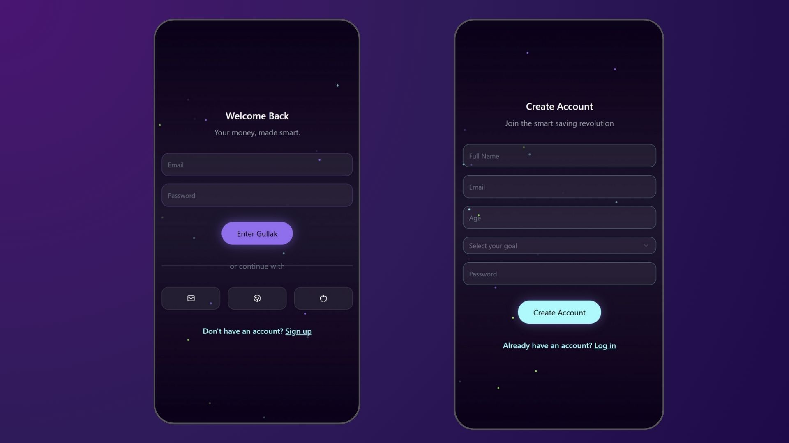
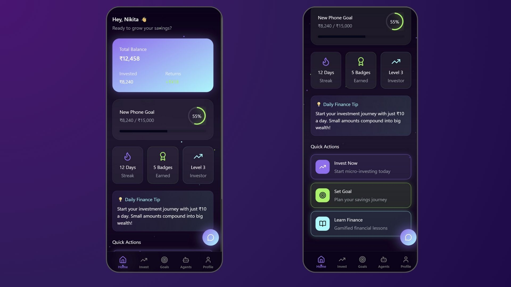
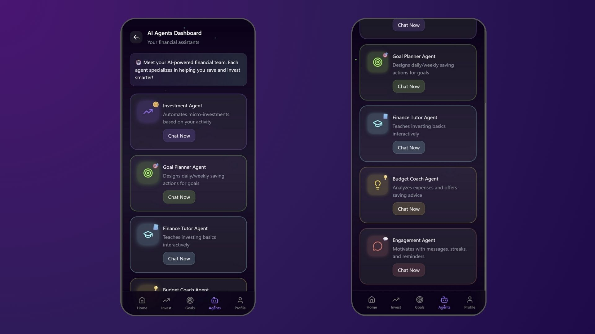
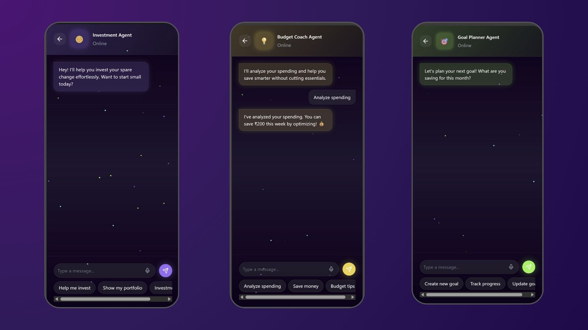
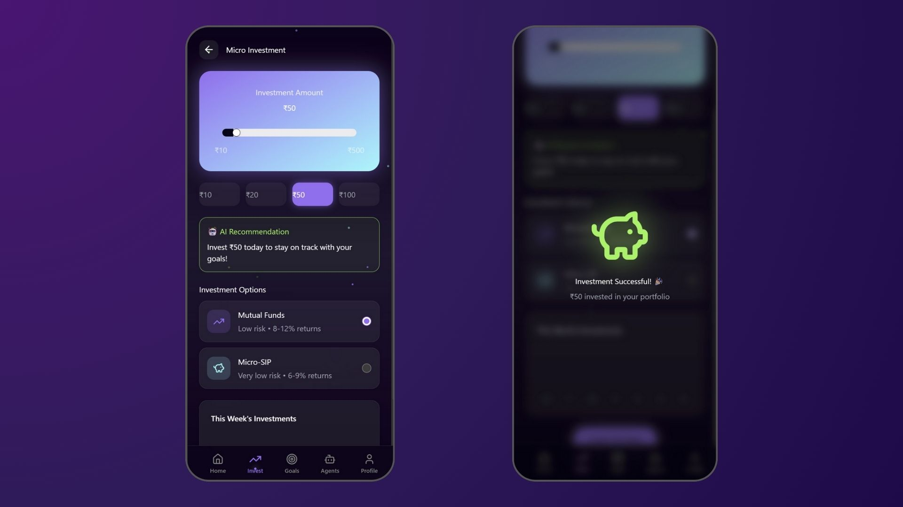
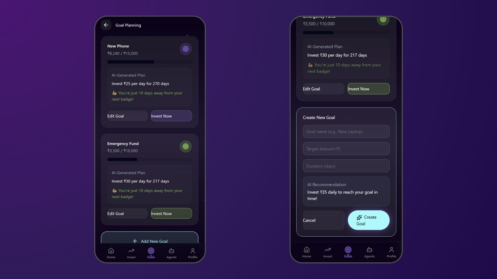

## || LIVE DEMO COMING SOON ||
# 💰 Gullak — AI-Powered Micro-Investing App  

> **Save Smart. Invest Small. Grow Big.**  
> A modern, gamified, and AI-driven micro-investing app for Gen-Z users (16–25 years old) with no prior investment experience.  

---

## 🧩 Core Features  

- **💸 Auto Micro-Investing** – Invest spare change automatically from purchases.  
- **🎯 Goal-Based Savings** – Set personal goals and get AI-generated saving plans.  
- **📚 Gamified Learning** – Learn finance through interactive quizzes and rewards.  
- **🤖 Personalized Insights** – Get AI-driven suggestions for budgeting and investing.  
- **🏆 Progress Motivation** – Earn badges, maintain streaks, and unlock rewards.  

---

## 🧠 Powered by Agentic AI  

| Agent | Role |
|--------|------|
| 🪙 **Investment Agent** | Automates micro-investments based on spending patterns. |
| 🎯 **Goal Planner Agent** | Breaks goals into daily/weekly saving actions. |
| 📘 **Finance Tutor Agent** | Teaches finance through interactive micro-lessons. |
| 💡 **Budget Coach Agent** | Analyzes expenses and suggests saving improvements. |
| 💬 **Engagement Agent** | Sends motivational nudges, tracks streaks, and keeps users engaged. |

---

## 🖥️ App Screens  

### Login & Signup  

  

### Home Dashboard  
- Displays current balance, total invested, and goal progress.  
- Streaks, badges, and daily AI finance tips.  
- Quick Actions: **Invest Now**, **Set Goal**, **Learn Finance**.

  

### AI Agents Dashboard  
- Showcasing five interactive chatbots:  
  Investment Agent | Goal Planner | Finance Tutor | Budget Coach | Engagement Agent.  
- Each agent has an avatar and **“Chat”** button leading to personalized interaction.  

  

### Chat Page  
- Dark, glowing chat interface with typing animations and emoji support.  
- First message from each AI agent introduces its role.  
- Option to switch between agents via **“Switch Agent”** button.  

  

### Micro-Investment  
- Round-up investments (₹10–₹50 per purchase).  
- AI recommendations: *“Invest ₹25 today to stay on track.”*  
- Safe options like mutual funds / micro-SIPs.

  

### Goal Planning  
- Create personalized goals (e.g., “Save ₹5,000 for phone”).  
- AI-generated plan: *“Invest ₹25/day to reach your goal.”*  
- Animated progress bars and motivational messages. 

  

### Settings & Profile  
- Manage notifications, AI preferences, and account info.  
- Track badges, levels, and progress — like a finance RPG.  

---

## 🎨 UI & Design System  

| Element | Style |
|----------|--------|
| **Theme** | Dark Mode (#0D0D0D / #121212) |
| **Accent Colors** | Purple `#A259FF`, Neon Green `#39FF14`, Cyan `#00FFFF` |
| **Typography** | Inter / Poppins / Montserrat |
| **Animations** | Coin drop, glowing buttons, streak sparkles, progress transitions |
| **Layout Style** | Minimal, flat design with soft neon glows and smooth transitions |

---

## ⚙️ Tech Stack 

| Layer | Technology |
|--------|-------------|
| **Frontend** | React Native  |
| **Backend** | Node.js + Express |
| **AI Layer** | Python (LangGraph / CrewAI) for Agentic AI |
| **Database** | MongoDB  |
| **Payment API** |  Groww API |
| **Hosting** | AWS  |

---
